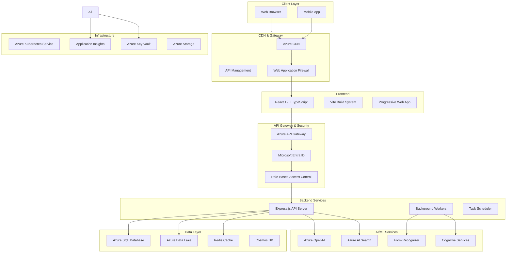
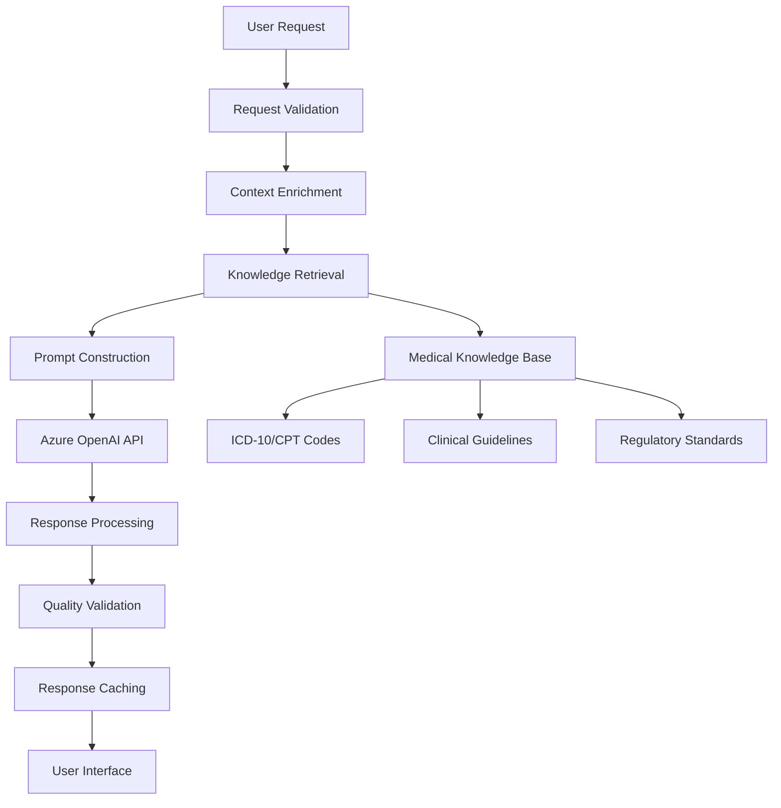

# Billigent Technical Architecture

**Version:** 1.0  
**Date:** August 10, 2025  
**Status:** Active Development  
**Owner:** Engineering Team

## Architecture Overview

Billigent is built as a cloud-native, microservices-based platform leveraging Azure's ecosystem for scalability, security, and compliance. The architecture follows Domain-Driven Design (DDD) principles with clear separation of concerns and HIPAA-compliant healthcare data handling.

## System Architecture Diagram



## Technology Stack

### Frontend Architecture

#### React 19 + TypeScript
- **Framework**: React 19 with concurrent features
- **Language**: TypeScript 5.9+ for type safety
- **Build Tool**: Vite 5.4+ for fast development and optimized builds
- **Styling**: Tailwind CSS 4.1 for utility-first styling
- **Component Library**: Shadcn/ui for consistent design system

#### State Management
- **Server State**: TanStack Query (React Query) for API data management
- **Client State**: React Context + useReducer for application state
- **Form State**: React Hook Form with Zod validation
- **Cache Strategy**: Intelligent caching with stale-while-revalidate

#### Performance Optimizations
- **Code Splitting**: Route-based and component-based lazy loading
- **Bundle Analysis**: Optimized chunks for vendor, UI, and application code
- **Service Worker**: Offline capabilities and intelligent caching
- **Image Optimization**: WebP format with lazy loading

```typescript
// Frontend Architecture Example
interface ApplicationArchitecture {
  // Route-based code splitting
  routes: {
    dashboard: React.lazy(() => import('./pages/Dashboard'));
    caseManagement: React.lazy(() => import('./pages/CaseManagement'));
    denials: React.lazy(() => import('./pages/DenialsManagement'));
  };
  
  // State management layers
  state: {
    server: TanStackQuery;
    client: ReactContext;
    forms: ReactHookForm;
    cache: ServiceWorker;
  };
  
  // Performance monitoring
  monitoring: {
    webVitals: CoreWebVitals;
    userExperience: ApplicationInsights;
    errorBoundaries: ErrorTracking;
  };
}
```

### Backend Architecture

#### Node.js + Express Framework
- **Runtime**: Node.js 22 LTS for performance and stability
- **Framework**: Express.js with TypeScript for API development
- **ORM**: Prisma for type-safe database access
- **Validation**: Zod for runtime type validation
- **Authentication**: Microsoft Entra ID integration

#### Microservices Design
```typescript
interface MicroserviceArchitecture {
  services: {
    auth: AuthenticationService;
    cases: CaseManagementService;
    denials: DenialsProcessingService;
    analytics: AnalyticsService;
    ai: AIOrchestrationService;
    notifications: NotificationService;
  };
  
  communication: {
    http: RESTfulAPIs;
    messaging: AzureServiceBus;
    events: EventDrivenArchitecture;
  };
  
  dataAccess: {
    relational: PrismaORM;
    documents: CosmosDB;
    cache: RedisCache;
    files: AzureBlobStorage;
  };
}
```

#### API Design Principles
- **RESTful APIs**: Resource-based URLs with proper HTTP methods
- **OpenAPI Specification**: Comprehensive API documentation
- **Versioning**: API versioning strategy for backward compatibility
- **Rate Limiting**: Intelligent throttling based on user roles
- **Error Handling**: Consistent error response format

### Database Architecture

#### Primary Database: Azure SQL Database
```sql
-- Core Entity Relationships
CREATE TABLE Users (
    Id UNIQUEIDENTIFIER PRIMARY KEY,
    Email NVARCHAR(255) NOT NULL,
    Role NVARCHAR(50) NOT NULL,
    Department NVARCHAR(100),
    CreatedAt DATETIME2 DEFAULT GETUTCDATE(),
    UpdatedAt DATETIME2 DEFAULT GETUTCDATE()
);

CREATE TABLE Cases (
    Id UNIQUEIDENTIFIER PRIMARY KEY,
    PatientId UNIQUEIDENTIFIER NOT NULL,
    EncounterId NVARCHAR(100) NOT NULL,
    Status NVARCHAR(50) DEFAULT 'PENDING',
    Priority INT DEFAULT 5,
    EstimatedValue DECIMAL(10,2),
    CreatedAt DATETIME2 DEFAULT GETUTCDATE(),
    AssignedTo UNIQUEIDENTIFIER,
    FOREIGN KEY (AssignedTo) REFERENCES Users(Id)
);

CREATE TABLE Diagnoses (
    Id UNIQUEIDENTIFIER PRIMARY KEY,
    CaseId UNIQUEIDENTIFIER NOT NULL,
    ICD10Code NVARCHAR(10) NOT NULL,
    Description NVARCHAR(500),
    IsPresent BIT DEFAULT 1,
    Specificity INT DEFAULT 1,
    FOREIGN KEY (CaseId) REFERENCES Cases(Id)
);
```

#### Data Lake Architecture
```
Azure Data Lake Storage Gen2:
/bronze/                    # Raw data ingestion
  /fhir/                   # FHIR resources from EHR systems
    /patients/             # Patient demographics
    /encounters/           # Clinical encounters
    /observations/         # Clinical observations
  /terminologies/          # Medical coding standards
    /icd10/               # ICD-10 diagnosis codes
    /cpt/                 # CPT procedure codes
    /hcpcs/               # HCPCS supply codes
  /documents/              # Unstructured documents
    /denials/             # Denial letters and EOBs
    /clinical-notes/      # Clinical documentation

/silver/                    # Processed and validated data
  /standardized/           # Cleaned and standardized datasets
  /enriched/              # Data with additional context
  /validated/             # Quality-checked data

/gold/                      # Business-ready analytics data
  /reporting/             # Data marts for reporting
  /ml-features/           # Engineered features for ML
  /kpis/                  # Real-time KPI calculations
```

## AI/ML Architecture

### Azure OpenAI Integration

#### GPT-5-mini Implementation
```typescript
interface AzureOpenAIService {
  // Core conversation management
  createConversation(context: ClinicalContext): Promise<ConversationId>;
  addMessage(conversationId: string, message: UserMessage): Promise<void>;
  getResponse(conversationId: string): Promise<AIResponse>;
  
  // Specialized clinical functions
  analyzeClinicalDocumentation(
    encounter: FHIREncounter,
    context: ClinicalGuidelines
  ): Promise<DocumentationAnalysis>;
  
  generateCodingRecommendations(
    diagnosis: string,
    procedures: string[],
    context: MedicalCodingStandards
  ): Promise<CodingRecommendation[]>;
  
  createAppealLetter(
    denial: DenialDetails,
    evidence: ClinicalEvidence
  ): Promise<AppealDocument>;
}
```

#### Responses API Architecture


### Retrieval-Augmented Generation (RAG)

#### Vector Database: Azure AI Search
```typescript
interface RAGArchitecture {
  // Vector store configuration
  vectorStore: {
    service: AzureAISearch;
    dimensions: 1536; // OpenAI embedding dimensions
    similarityAlgorithm: 'cosine';
    indexStrategy: 'hierarchical';
  };
  
  // Knowledge sources
  knowledgeSources: {
    medicalCoding: MedicalCodingDatabase;
    clinicalGuidelines: ClinicalGuidelinesDB;
    regulatoryDocs: RegulatoryDocuments;
    historicalCases: CaseHistoryDB;
  };
  
  // Retrieval pipeline
  retrievalPipeline: {
    queryExpansion: QueryExpansionService;
    semanticSearch: SemanticSearchEngine;
    contextRanking: ContextRankingAlgorithm;
    relevanceFiltering: RelevanceFilter;
  };
}
```

#### Embedding Strategy
```typescript
interface EmbeddingStrategy {
  // Text preprocessing
  preprocessing: {
    tokenization: MedicalTokenizer;
    normalization: TextNormalization;
    entityRecognition: MedicalNER;
  };
  
  // Embedding generation
  embedding: {
    model: 'text-embedding-ada-002';
    batchSize: 100;
    maxTokens: 8191;
    parallelProcessing: true;
  };
  
  // Vector storage
  storage: {
    indexing: HierarchicalNavigableSmallWorld;
    compression: ProductQuantization;
    updateStrategy: IncrementalUpdate;
  };
}
```

## Security Architecture

### Authentication & Authorization

#### Microsoft Entra ID Integration
```typescript
interface SecurityArchitecture {
  // Authentication layer
  authentication: {
    provider: MicrosoftEntraID;
    protocol: OAuth2_OIDC;
    tokenLifetime: '8 hours';
    refreshTokens: true;
    multiFactorAuth: Required;
  };
  
  // Authorization framework
  authorization: {
    rbac: RoleBasedAccessControl;
    abac: AttributeBasedAccessControl;
    dataPermissions: DataLevelSecurity;
    apiPermissions: EndpointSecurity;
  };
  
  // Healthcare-specific roles
  roles: {
    cdiSpecialist: CDISpecialistRole;
    revenueCycleManager: RevenueCycleManagerRole;
    codingSpecialist: CodingSpecialistRole;
    healthcareAdmin: HealthcareAdminRole;
    systemAdmin: SystemAdminRole;
  };
}
```

#### Role-Based Access Control (RBAC)
```typescript
enum Permission {
  // Case management permissions
  VIEW_CASES = 'cases:view',
  EDIT_CASES = 'cases:edit',
  DELETE_CASES = 'cases:delete',
  ASSIGN_CASES = 'cases:assign',
  
  // Analytics permissions
  VIEW_ANALYTICS = 'analytics:view',
  EXPORT_REPORTS = 'analytics:export',
  
  // Denials management
  PROCESS_DENIALS = 'denials:process',
  GENERATE_APPEALS = 'denials:appeal',
  
  // System administration
  MANAGE_USERS = 'users:manage',
  SYSTEM_CONFIG = 'system:config',
  AUDIT_LOGS = 'audit:view'
}

interface Role {
  id: string;
  name: string;
  permissions: Permission[];
  dataScope: DataScope;
}
```

### Data Security & HIPAA Compliance

#### Encryption Strategy
```typescript
interface EncryptionStrategy {
  // Data at rest
  atRest: {
    algorithm: 'AES-256-GCM';
    keyManagement: AzureKeyVault;
    keyRotation: 'monthly';
    transparentDataEncryption: true;
  };
  
  // Data in transit
  inTransit: {
    protocol: 'TLS 1.3';
    certificateManagement: AzureKeyVault;
    perfectForwardSecrecy: true;
    certificateRotation: 'quarterly';
  };
  
  // Application-level encryption
  applicationLevel: {
    fieldLevelEncryption: SensitiveFields;
    tokenization: PHITokenization;
    deterministicEncryption: SearchableFields;
  };
}
```

#### Audit & Compliance Framework
```typescript
interface ComplianceFramework {
  // HIPAA compliance
  hipaa: {
    auditLogging: ComprehensiveAuditTrail;
    accessControls: MinimumNecessary;
    dataIntegrity: CryptographicHashing;
    breachNotification: AutomatedAlerts;
  };
  
  // SOX compliance
  sox: {
    financialControls: FinancialDataProtection;
    auditTrails: ImmutableLogs;
    accessReviews: QuarterlyAccessReviews;
    changeManagement: ControlledDeployments;
  };
  
  // Security monitoring
  monitoring: {
    realTimeAlerts: SecurityIncidentDetection;
    anomalyDetection: UserBehaviorAnalytics;
    threatIntelligence: SecurityThreatFeeds;
    incidentResponse: AutomatedResponsePlaybooks;
  };
}
```

## Infrastructure Architecture

### Azure Kubernetes Service (AKS)

#### Cluster Configuration
```yaml
# AKS cluster specification
apiVersion: v1
kind: ConfigMap
metadata:
  name: billigent-config
data:
  cluster-config: |
    nodePool:
      - name: system
        nodeCount: 3
        vmSize: Standard_D4s_v3
        osDiskSizeGB: 128
        maxPods: 30
      - name: compute
        nodeCount: 5
        vmSize: Standard_D8s_v3
        osDiskSizeGB: 256
        maxPods: 50
        enableAutoScaling: true
        minCount: 3
        maxCount: 10
    
    networking:
      networkPlugin: azure
      serviceCidr: 10.0.0.0/16
      dnsServiceIP: 10.0.0.10
      dockerBridgeCidr: 172.17.0.1/16
    
    security:
      rbac: enabled
      networkPolicy: azure
      keyVaultSecretsProvider: enabled
      workloadIdentity: enabled
```

#### Container Architecture
```dockerfile
# Multi-stage build for Node.js backend
FROM node:22-alpine AS base
WORKDIR /app
COPY package*.json ./
RUN npm ci --only=production && npm cache clean --force

FROM node:22-alpine AS build
WORKDIR /app
COPY package*.json ./
RUN npm ci
COPY . .
RUN npm run build

FROM node:22-alpine AS production
WORKDIR /app
COPY --from=base /app/node_modules ./node_modules
COPY --from=build /app/dist ./dist
COPY --from=build /app/package*.json ./
USER node
EXPOSE 3000
CMD ["node", "dist/main.js"]
```

### Monitoring & Observability

#### Application Insights Integration
```typescript
interface MonitoringStrategy {
  // Application monitoring
  applicationInsights: {
    performanceCounters: SystemMetrics;
    customEvents: BusinessMetrics;
    dependencyTracking: ExternalServices;
    exceptionTracking: ErrorAnalysis;
  };
  
  // Distributed tracing
  distributedTracing: {
    correlationIds: RequestTracking;
    spanData: ServiceDependencies;
    performanceMetrics: ResponseTimes;
    errorCorrelation: FailureAnalysis;
  };
  
  // Business metrics
  businessMetrics: {
    userEngagement: UserActivityMetrics;
    featureUsage: FeatureAdoptionRates;
    performanceKPIs: BusinessProcessMetrics;
    healthScores: SystemHealthIndicators;
  };
}
```

#### Alerting & Incident Response
```typescript
interface AlertingStrategy {
  // Performance alerts
  performance: {
    responseTimeThreshold: '2 seconds';
    errorRateThreshold: '1%';
    availabilityThreshold: '99.9%';
    diskSpaceThreshold: '80%';
  };
  
  // Security alerts
  security: {
    unauthorizedAccess: ImmediateAlert;
    dataExfiltration: CriticalAlert;
    anomalousActivity: WarningAlert;
    complianceViolation: CriticalAlert;
  };
  
  // Business alerts
  business: {
    processingDelays: BusinessImpactAlert;
    dataQualityIssues: OperationalAlert;
    userExperienceIssues: UserImpactAlert;
    integrationFailures: SystemAlert;
  };
}
```

## Deployment Architecture

### CI/CD Pipeline

#### GitHub Actions Workflow
```yaml
name: Billigent CI/CD Pipeline

on:
  push:
    branches: [main, develop]
  pull_request:
    branches: [main]

jobs:
  test:
    runs-on: ubuntu-latest
    steps:
      - uses: actions/checkout@v4
      - uses: actions/setup-node@v4
        with:
          node-version: '22'
          cache: 'npm'
      
      - name: Install dependencies
        run: npm ci
      
      - name: Run tests
        run: npm run test:coverage
      
      - name: Run E2E tests
        run: npm run test:e2e
      
      - name: Security scan
        run: npm audit --audit-level high

  build:
    needs: test
    runs-on: ubuntu-latest
    steps:
      - uses: actions/checkout@v4
      
      - name: Build Docker images
        run: |
          docker build -t billigent-frontend ./apps/frontend
          docker build -t billigent-backend ./apps/backend
      
      - name: Push to Azure Container Registry
        run: |
          az acr login --name billigentacr
          docker tag billigent-frontend billigentacr.azurecr.io/frontend:${{ github.sha }}
          docker tag billigent-backend billigentacr.azurecr.io/backend:${{ github.sha }}
          docker push billigentacr.azurecr.io/frontend:${{ github.sha }}
          docker push billigentacr.azurecr.io/backend:${{ github.sha }}

  deploy:
    needs: build
    runs-on: ubuntu-latest
    if: github.ref == 'refs/heads/main'
    steps:
      - name: Deploy to AKS
        run: |
          az aks get-credentials --resource-group billigent-rg --name billigent-aks
          kubectl set image deployment/frontend frontend=billigentacr.azurecr.io/frontend:${{ github.sha }}
          kubectl set image deployment/backend backend=billigentacr.azurecr.io/backend:${{ github.sha }}
          kubectl rollout status deployment/frontend
          kubectl rollout status deployment/backend
```

### Environment Strategy
```typescript
interface EnvironmentStrategy {
  // Development environment
  development: {
    infrastructure: LocalDevelopment;
    database: SqliteInMemory;
    authentication: MockAuthentication;
    monitoring: BasicLogging;
  };
  
  // Staging environment
  staging: {
    infrastructure: AzureContainerApps;
    database: AzureSQLDatabaseBasic;
    authentication: EntraIDIntegration;
    monitoring: ApplicationInsights;
  };
  
  // Production environment
  production: {
    infrastructure: AzureKubernetesService;
    database: AzureSQLDatabasePremium;
    authentication: EntraIDWithMFA;
    monitoring: ComprehensiveObservability;
    highAvailability: MultiRegionDeployment;
  };
}
```

## Performance & Scalability

### Performance Requirements
- **Frontend Load Time**: < 2 seconds initial page load
- **API Response Time**: < 500ms for 95% of requests
- **Database Query Time**: < 200ms for complex queries
- **AI Response Time**: < 10 seconds for complex analysis
- **Concurrent Users**: 1,000+ simultaneous users

### Scalability Strategy
```typescript
interface ScalabilityStrategy {
  // Horizontal scaling
  horizontalScaling: {
    frontend: StaticAssetCDN;
    backend: KubernetesAutoScaling;
    database: ReadReplicas;
    cache: RedisCluster;
  };
  
  // Performance optimization
  optimization: {
    caching: MultiLayerCaching;
    compression: GzipAndBrotli;
    bundleOptimization: CodeSplitting;
    imageOptimization: WebPFormat;
  };
  
  // Load balancing
  loadBalancing: {
    global: AzureTrafficManager;
    regional: AzureLoadBalancer;
    application: IngressController;
  };
}
```

## Disaster Recovery & Business Continuity

### Backup Strategy
```typescript
interface BackupStrategy {
  // Database backups
  database: {
    frequency: 'hourly';
    retention: '30 days';
    crossRegion: true;
    pointInTimeRecovery: true;
  };
  
  // File storage backups
  storage: {
    frequency: 'daily';
    retention: '90 days';
    geoRedundancy: true;
    versionControl: true;
  };
  
  // Configuration backups
  configuration: {
    frequency: 'on-change';
    versionControl: GitRepository;
    immutableStorage: true;
  };
}
```

### Disaster Recovery Plan
- **RTO (Recovery Time Objective)**: 4 hours
- **RPO (Recovery Point Objective)**: 1 hour
- **Multi-Region Deployment**: Primary (East US 2), Secondary (West US 2)
- **Automated Failover**: Azure Traffic Manager with health probes
- **Data Synchronization**: Continuous replication with conflict resolution

## Integration Architecture

### EHR System Integration
```typescript
interface EHRIntegration {
  // FHIR R4 compliance
  fhir: {
    resources: [Patient, Encounter, Observation, DiagnosticReport];
    operations: [create, read, update, search];
    authentication: OAuth2WithPKCE;
    security: TLS1_3_Mutual_Auth;
  };
  
  // Major EHR systems
  systems: {
    epic: EpicFHIRIntegration;
    cerner: CernerFHIRIntegration;
    allscripts: AllscriptsFHIRIntegration;
    athenahealth: AthenaFHIRIntegration;
  };
  
  // Data synchronization
  synchronization: {
    realTime: FHIRSubscriptions;
    batch: ScheduledBulkExport;
    errorHandling: RetryWithExponentialBackoff;
  };
}
```

## Compliance & Governance

### Technical Governance Framework
```typescript
interface TechnicalGovernance {
  // Code quality standards
  codeQuality: {
    testCoverage: '>90%';
    linting: ESLintStrict;
    typeScript: StrictMode;
    security: SonarQubeScan;
  };
  
  // Architecture governance
  architecture: {
    designReviews: MandatoryForMajorChanges;
    technicalDebt: QuarterlyAssessment;
    performanceReviews: ContinuousMonitoring;
    securityReviews: MonthlyAssessment;
  };
  
  // Deployment governance
  deployment: {
    approvalProcess: PeerReviewRequired;
    rollbackProcedure: AutomatedRollback;
    changeTracking: ComprehensiveAuditLog;
    riskAssessment: PreDeploymentChecks;
  };
}
```

---

**Document Status**: Active Development  
**Next Review**: September 10, 2025  
**Owner**: Engineering Team  
**Stakeholders**: DevOps, Security, Compliance, Product Management
