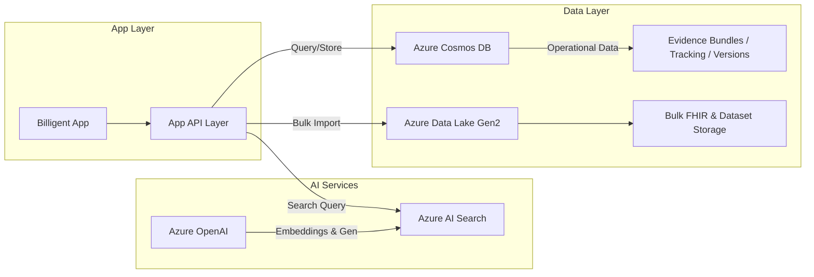

# Azure Services Configuration Guide

This document outlines the configuration required for Azure services integration in **Billigent**, using **Azure Cosmos DB** and **Azure Data Lake** exclusively for data storage and persistence.

---

## 🔐 **Required Environment Variables**

### Azure OpenAI Configuration

```bash
AZURE_OPENAI_ENDPOINT=https://your-resource.openai.azure.com/
AZURE_OPENAI_API_KEY=your-api-key-here
AZURE_OPENAI_DEPLOYMENT_NAME=gpt-4o-mini
AZURE_OPENAI_EMBEDDING_DEPLOYMENT=text-embedding-3-small
```

### Azure AI Search Configuration

```bash
AZURE_SEARCH_ENDPOINT=https://your-search-service.search.windows.net
AZURE_SEARCH_API_KEY=your-search-api-key-here
AZURE_SEARCH_INDEX_NAME=clinical-documents
```

### Azure Data Lake Configuration (for FHIR and bulk data ingestion)

```bash
AZURE_STORAGE_ACCOUNT_NAME=yourstorageaccount
AZURE_STORAGE_ACCOUNT_KEY=your-storage-account-key
AZURE_STORAGE_CONTAINER_NAME=fhir-data
```

### Azure Cosmos DB (primary operational and persistent store)

```bash
AZURE_COSMOS_ENDPOINT=https://your-cosmos-account.documents.azure.com:443/
AZURE_COSMOS_KEY=your-cosmos-key
AZURE_COSMOS_DATABASE=billigent
AZURE_COSMOS_CONTAINER=evidence-bundles
```

---

## 🚀 **Setup Instructions**

### 1. Azure OpenAI Setup

1. Create an Azure OpenAI resource in your Azure portal.
2. Deploy:

   * GPT-4o-mini for text generation.
   * text-embedding-3-small for embeddings.
3. Copy endpoint and API key to environment variables.

---

### 2. Azure AI Search Setup

1. Create an Azure AI Search service.
2. Define index schema:

   ```json
   {
     "name": "clinical-documents",
     "fields": [
       { "name": "id", "type": "Edm.String", "key": true },
       { "name": "content", "type": "Edm.String", "searchable": true, "analyzer": "en.microsoft" },
       { "name": "vector", "type": "Collection(Edm.Single)", "dimensions": 1536, "vectorSearchProfile": "my-vector-profile" },
       { "name": "metadata", "type": "Edm.String", "searchable": false }
     ],
     "vectorSearch": {
       "profiles": [{ "name": "my-vector-profile", "algorithm": "hnsw" }]
     }
   }
   ```

---

### 3. Azure Cosmos DB Setup

1. **Create Cosmos DB Account**:

   ```bash
   az cosmosdb create \
     --name billigent-cosmos-dev \
     --resource-group rg-billigent-dev-eus2 \
     --locations regionName=eastus2 failoverPriority=0 isZoneRedundant=false \
     --capabilities EnableServerless \
     --default-consistency-level Session \
     --enable-analytical-storage true
   ```
2. **Create Database**:

   ```bash
   az cosmosdb sql database create \
     --account-name billigent-cosmos-dev \
     --resource-group rg-billigent-dev-eus2 \
     --name billigent
   ```
3. **Create Containers**:

   ```bash
   az cosmosdb sql container create \
     --account-name billigent-cosmos-dev \
     --resource-group rg-billigent-dev-eus2 \
     --database-name billigent \
     --name evidence-bundles \
     --partition-key-path "/patientId"

   az cosmosdb sql container create \
     --account-name billigent-cosmos-dev \
     --resource-group rg-billigent-dev-eus2 \
     --database-name billigent \
     --name attribution-tracking \
     --partition-key-path "/bundleId"

   az cosmosdb sql container create \
     --account-name billigent-cosmos-dev \
     --resource-group rg-billigent-dev-eus2 \
     --database-name billigent \
     --name document-versions \
     --partition-key-path "/documentId"

   az cosmosdb sql container create \
     --account-name billigent-cosmos-dev \
     --resource-group rg-billigent-dev-eus2 \
     --database-name billigent \
     --name collaboration-sessions \
     --partition-key-path "/sessionId"
   ```

---

### 4. Azure Data Lake Setup

1. Create a Storage Account.
2. Enable **Data Lake Storage Gen2**.
3. Create containers for:

   * `fhir-data` (primary ingestion container)
   * Additional containers as needed for large datasets.
4. Configure **RBAC** and **access policies**.

---

## 🔒 **Security Best Practices**

* **Use Managed Identity** for Cosmos DB and Data Lake access where possible.
* **Restrict network access** via Private Link and firewall rules.
* Store all sensitive keys in **Azure Key Vault**.
* Apply **least privilege** permissions via Azure RBAC.

---

## 📊 **Performance Configuration**

```bash
MAX_CONCURRENT_REQUESTS=100
REQUEST_TIMEOUT=30000
SEARCH_TIMEOUT=10000
OPENAI_TIMEOUT=60000
```

---

## 🧪 **Testing Configuration**

```bash
ENABLE_MOCK_DATA=true
ENABLE_AZURE_OPENAI=true
ENABLE_AZURE_SEARCH=true
ENABLE_AZURE_DATA_LAKE=true
ENABLE_AZURE_COSMOS=true
```

---

## 🚨 **Troubleshooting**

* **Auth errors** → check Managed Identity or key configuration.
* **Network issues** → validate Private Link / firewall settings.
* **Performance issues** → adjust Cosmos DB RU/s and indexing strategy.

---

## 📈 **Monitoring**

* **Azure Monitor** → Metrics + alert rules.
* **Application Insights** → Performance + dependency tracking.
* **Log Analytics** → Centralized logging + query support.

---

## 🔄 **Deployment**

* **Dev**: direct connections to Azure services with mock data fallback enabled.
* **Prod**: Managed Identity for Cosmos DB/Data Lake, secrets in Key Vault, full monitoring + alerting.
* **CI/CD**: Azure DevOps or GitHub Actions for automated deployments.

---

### **Updated Architecture Diagram (Post-Removal of SQL/Redis/Prisma)**


