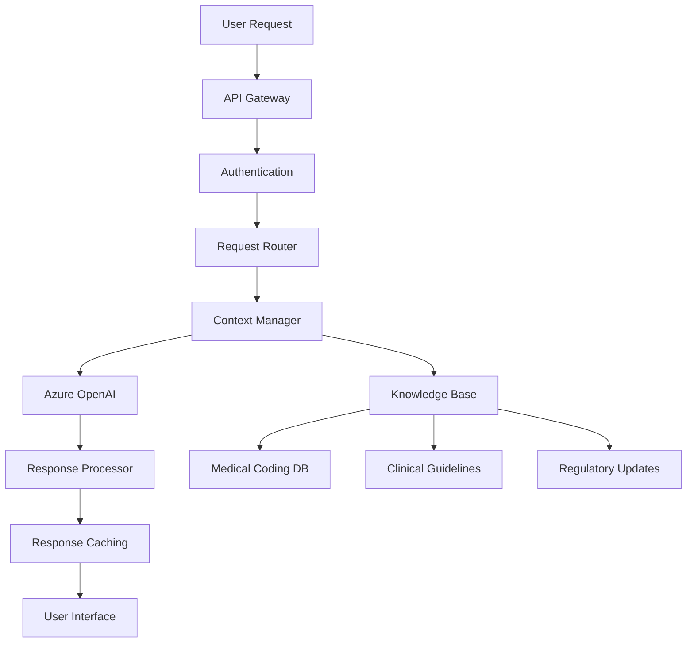
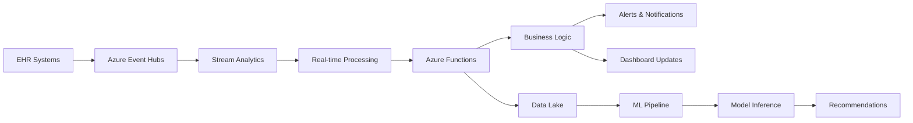

# Billigent Data & AI Strategy Plan

**Version:** 1.0  
**Date:** August 10, 2025  
**Status:** Active Implementation  
**Owner:** Data & AI Team

## Executive Summary

This document outlines the comprehensive data and AI strategy for the Billigent clinical intelligence platform. Our approach leverages Azure's native AI services, implements a robust data lake architecture, and ensures HIPAA-compliant healthcare data management while delivering intelligent automation for clinical documentation improvement and revenue cycle optimization.

## Data Architecture Strategy

### Data Lake Architecture (Bronze-Silver-Gold)

#### Bronze Layer: Raw Data Ingestion

- **Purpose**: Landing zone for all raw healthcare data
- **Storage**: Azure Data Lake Storage Gen2
- **Structure**:
  ```
  billigentdevdlseus2/bronze/
  ├── fhir-data/           # Raw FHIR resources from EHR systems
  ├── terminologies/       # Medical coding standards (ICD-10, CPT, HCPCS)
  ├── synthetic-data/      # Synthea-generated test data
  ├── denial-documents/    # Raw denial letters and EOBs
  └── audit-logs/         # System audit and access logs
  ```
- **Retention**: 7 years (regulatory compliance)
- **Access**: Restricted to data engineering team

#### Silver Layer: Cleaned & Standardized Data

- **Purpose**: Processed, validated, and standardized data
- **Processing**: Azure Data Factory + Azure Functions
- **Structure**:
  ```
  billigentdevdlseus2/silver/
  ├── patients/           # Standardized patient demographics
  ├── encounters/         # Processed clinical encounters
  ├── diagnoses/          # Validated diagnosis codes
  ├── procedures/         # Standardized procedure data
  ├── denials/           # Processed denial reasons and outcomes
  └── analytics/         # Pre-aggregated analytics data
  ```
- **Quality Assurance**: Automated validation rules, data profiling
- **Access**: Data analysts, AI/ML engineers

#### Gold Layer: Business-Ready Analytics

- **Purpose**: Curated, business-ready datasets for reporting and ML
- **Processing**: Azure Synapse Analytics
- **Structure**:
  ```
  billigentdevdlseus2/gold/
  ├── kpi-metrics/        # Real-time KPI calculations
  ├── ml-features/        # Engineered features for ML models
  ├── reporting-marts/    # Data marts for dashboards
  └── ai-training/       # Curated training datasets
  ```
- **Optimization**: Partitioned by date, indexed for fast queries
- **Access**: Business users, reporting tools, ML models

### Data Ingestion Strategy

#### FHIR R4 Ingestion Pipeline

- **Source Systems**: Epic, Cerner, AllScripts, and other FHIR-enabled EHRs
- **Ingestion Method**:
  - Real-time: FHIR subscriptions for critical events
  - Batch: Scheduled bulk data export for historical data
- **Processing Engine**: Azure Functions with FHIR server integration
- **Data Validation**: FHIR resource validation, business rule checking
- **Error Handling**: Dead letter queues, retry logic, alerting

#### Medical Coding Standards Ingestion

- **Sources**: CMS, X12, AMA, WHO
- **Datasets**:
  - ICD-10-CM/PCS (95K+ diagnosis codes)
  - CPT/HCPCS (40K+ procedure codes)
  - MS-DRG (750+ grouper codes)
  - CARC/RARC (1,600+ adjustment codes)
  - NCCI Edits (675K+ edit pairs)
- **Update Frequency**: Quarterly automatic updates
- **Processing**: Custom TypeScript parsers with Azure Functions

#### Document Processing Pipeline

- **Sources**: Denial letters, EOBs, clinical notes
- **Processing Engine**: Azure Form Recognizer + Azure Cognitive Services
- **OCR Accuracy**: > 95% for structured documents
- **Data Extraction**: Structured data from unstructured documents
- **Storage**: Processed text in Azure Cognitive Search

### Data Governance Framework

#### Data Quality Management

- **Validation Rules**:
  - FHIR resource schema validation
  - Business rule compliance checking
  - Referential integrity constraints
  - Completeness and accuracy metrics
- **Monitoring**: Azure Monitor + custom dashboards
- **Alerting**: Automated alerts for data quality issues
- **Remediation**: Automated retry logic + manual intervention workflows

#### Data Lineage & Catalog

- **Cataloging Tool**: Azure Purview
- **Lineage Tracking**: End-to-end data flow documentation
- **Metadata Management**: Automated schema discovery and documentation
- **Data Discovery**: Self-service data discovery for business users

#### Privacy & Security

- **De-identification**: Automated PHI removal using Azure Text Analytics
- **Encryption**: AES-256 at rest, TLS 1.3 in transit
- **Access Control**: Azure RBAC with healthcare-specific roles
- **Audit Logging**: Comprehensive access and modification logs
- **Compliance**: HIPAA, HITECH, SOX audit trails

## AI/ML Strategy

### Azure OpenAI Integration

#### Primary Model: GPT-5-mini

- **Use Cases**:
  - Clinical documentation analysis
  - Coding recommendation generation
  - Appeal letter creation
  - Natural language query processing
- **API Integration**: Azure OpenAI Responses API
- **Response Management**: Stateful conversations with context preservation
- **Rate Limiting**: 1M tokens/month with burst capacity
- **Cost Optimization**: Intelligent caching and context compression

#### Deployment Architecture



### Retrieval-Augmented Generation (RAG)

#### Knowledge Base Architecture

- **Vector Database**: Azure AI Search with vector indices
- **Embedding Model**: Azure OpenAI text-embedding-ada-002
- **Knowledge Sources**:
  - Medical coding standards (ICD-10, CPT, HCPCS)
  - Clinical practice guidelines
  - Regulatory documentation
  - Historical case precedents
- **Vector Dimensions**: 1536 (OpenAI standard)
- **Similarity Search**: Cosine similarity with 0.7 threshold

#### RAG Pipeline Implementation

```typescript
interface RAGPipeline {
  // Knowledge retrieval
  retrieveContext(query: string): Promise<KnowledgeChunk[]>;

  // Context ranking and filtering
  rankContext(chunks: KnowledgeChunk[]): KnowledgeChunk[];

  // Prompt augmentation
  augmentPrompt(query: string, context: KnowledgeChunk[]): string;

  // LLM generation
  generateResponse(prompt: string): Promise<AIResponse>;

  // Response validation
  validateResponse(response: AIResponse): ValidationResult;
}
```

### Machine Learning Models

#### Documentation Quality Scoring Model

- **Purpose**: Assess clinical documentation completeness and quality
- **Algorithm**: Random Forest with feature engineering
- **Features**:
  - Documentation completeness percentage
  - Code specificity scores
  - Medical necessity indicators
  - Historical performance patterns
- **Training Data**: 10M+ historical encounters with outcomes
- **Accuracy Target**: > 85% precision for quality predictions

#### Denial Risk Prediction Model

- **Purpose**: Predict likelihood of claim denial before submission
- **Algorithm**: Gradient Boosting with LightGBM
- **Features**:
  - Diagnosis-procedure code combinations
  - Payer-specific patterns
  - Provider performance history
  - Documentation completeness scores
- **Training Data**: 5M+ historical claims with denial outcomes
- **Accuracy Target**: > 80% recall for high-risk claims

#### Appeal Success Optimization Model

- **Purpose**: Recommend optimal appeal strategies
- **Algorithm**: Multi-class classification with XGBoost
- **Features**:
  - Denial reason categories
  - Supporting documentation availability
  - Payer appeal patterns
  - Historical success rates
- **Training Data**: 1M+ appeal outcomes
- **Accuracy Target**: > 75% success rate improvement

### AI Model Lifecycle Management

#### Development Pipeline

```yaml
Model Development Workflow:
  1. Data Collection:
    - Synthetic data generation (Synthea)
    - De-identified historical data
    - Public healthcare datasets

  2. Feature Engineering:
    - Clinical NLP processing
    - Medical coding feature extraction
    - Temporal pattern analysis

  3. Model Training:
    - Cross-validation with temporal splits
    - Hyperparameter optimization
    - Ensemble model creation

  4. Validation:
    - Clinical expert review
    - Bias detection and mitigation
    - Performance benchmarking

  5. Deployment:
    - A/B testing framework
    - Gradual rollout strategy
    - Performance monitoring
```

#### MLOps Implementation

- **Version Control**: DVC for data and model versioning
- **Experiment Tracking**: MLflow with Azure Machine Learning
- **Model Registry**: Azure Machine Learning model registry
- **Deployment**: Azure Container Instances for model serving
- **Monitoring**: Model drift detection with Azure Monitor
- **Retraining**: Automated retraining triggers based on performance metrics

### AI Safety & Ethics

#### Bias Detection & Mitigation

- **Demographic Bias**: Regular analysis across patient populations
- **Clinical Bias**: Validation against clinical guidelines
- **Outcome Bias**: Fair representation across different outcomes
- **Mitigation Strategies**:
  - Diverse training data representation
  - Bias-aware model architectures
  - Regular fairness audits
  - Human oversight for critical decisions

#### Explainability Framework

- **Model Interpretability**: SHAP values for feature importance
- **Decision Transparency**: Clear reasoning for AI recommendations
- **Clinical Validation**: Expert review of AI reasoning
- **User Communication**: Plain-language explanations for clinical users

#### Human-in-the-Loop Design

- **Critical Decision Points**: Human validation required for:
  - High-value coding recommendations
  - Complex appeal strategies
  - Unusual pattern detections
- **Confidence Thresholds**: AI recommendations below 80% confidence require human review
- **Feedback Loops**: User feedback integration for continuous improvement

## Real-Time Processing Architecture

### Event-Driven Data Pipeline



### Stream Processing Requirements

- **Latency**: < 5 seconds for critical alerts
- **Throughput**: 10,000 events/second peak capacity
- **Scalability**: Auto-scaling based on queue depth
- **Reliability**: 99.9% message delivery guarantee
- **Monitoring**: Real-time performance metrics and alerting

## Data Security & Compliance

### HIPAA Compliance Framework

#### Administrative Safeguards

- **Security Officer**: Designated healthcare data security officer
- **Workforce Training**: Regular HIPAA training and certification
- **Access Management**: Role-based access with least privilege principle
- **Incident Response**: Documented breach notification procedures

#### Physical Safeguards

- **Azure Data Centers**: SOC 2 Type II compliant facilities
- **Equipment Controls**: Hardware security modules for encryption keys
- **Media Controls**: Secure data destruction procedures
- **Facility Access**: Multi-factor authentication for physical access

#### Technical Safeguards

- **Access Control**: Azure Active Directory with conditional access
- **Audit Controls**: Comprehensive logging and monitoring
- **Integrity**: Cryptographic checksums for data validation
- **Transmission Security**: End-to-end encryption for all data transfers

### Data Encryption Strategy

- **At Rest**: AES-256 encryption with Azure Key Vault
- **In Transit**: TLS 1.3 for all network communications
- **In Processing**: Confidential computing with Azure Confidential VM
- **Key Management**: Azure Key Vault with HSM-backed keys
- **Key Rotation**: Automated monthly key rotation

## Performance & Scalability

### Performance Requirements

- **Query Response Time**: < 2 seconds for dashboard queries
- **AI Response Time**: < 10 seconds for complex analysis
- **Data Ingestion**: < 1 minute for real-time FHIR processing
- **Batch Processing**: < 4 hours for daily analytics updates
- **Concurrent Users**: 1,000+ simultaneous users

### Scalability Architecture

- **Microservices**: Containerized services with Kubernetes orchestration
- **Auto-scaling**: CPU/memory-based scaling with Azure AKS
- **Database Scaling**: Azure SQL Database with elastic pools
- **Caching Strategy**: Redis cache for frequently accessed data
- **CDN**: Azure CDN for static assets and global distribution

### Monitoring & Observability

#### Application Monitoring

- **Application Insights**: Performance, dependency, and exception tracking
- **Custom Metrics**: Business-specific KPIs and health indicators
- **Log Analytics**: Centralized logging with Azure Log Analytics
- **Alerting**: Proactive alerts for performance degradation

#### Data Quality Monitoring

- **Data Freshness**: Automated checks for data staleness
- **Completeness**: Missing data detection and alerting
- **Accuracy**: Business rule validation and anomaly detection
- **Consistency**: Cross-system data reconciliation

## Implementation Roadmap

### Phase 1: Foundation (Weeks 1-2) ✅

- [x] Azure Data Lake setup and configuration
- [x] Basic FHIR ingestion pipeline
- [x] Medical coding datasets acquisition and upload
- [x] Security framework implementation

### Phase 2: Core AI Capabilities (Weeks 3-6) 🔄

- [x] Azure OpenAI integration and testing
- [ ] RAG pipeline development and optimization
- [ ] Basic ML model training and deployment
- [ ] Real-time processing pipeline setup

### Phase 3: Advanced Analytics (Weeks 7-8) ⏳

- [ ] Advanced ML model development
- [ ] Stream processing implementation
- [ ] Performance optimization and scaling
- [ ] Comprehensive monitoring setup

### Phase 4: Production Readiness (Weeks 9-10) ⏳

- [ ] Security audit and penetration testing
- [ ] Performance testing and optimization
- [ ] Disaster recovery and backup procedures
- [ ] Documentation and training materials

## Success Metrics & KPIs

### Technical Metrics

- **Data Quality**: > 95% accuracy in processed data
- **AI Performance**: > 85% accuracy for coding recommendations
- **System Availability**: 99.9% uptime for critical services
- **Response Time**: 95% of queries under target latency
- **Security**: Zero HIPAA compliance violations

### Business Impact Metrics

- **Documentation Quality**: 40% improvement in CDI scores
- **Denial Prevention**: 50% reduction in preventable denials
- **Appeal Success**: 75% improvement in appeal success rates
- **User Adoption**: 80% of target users actively using AI features
- **ROI**: 300% return on investment within 12 months

### Data Governance Metrics

- **Data Lineage**: 100% of critical data flows documented
- **Privacy Compliance**: Zero PHI exposure incidents
- **Data Freshness**: < 15 minutes for real-time data
- **Quality Score**: > 90% overall data quality score
- **User Satisfaction**: > 4.5/5 for data accessibility and quality

## Risk Management

### Technical Risks

- **Data Integration Complexity**: Mitigation through FHIR standards and incremental rollout
- **AI Model Bias**: Mitigation through diverse training data and bias detection
- **Performance Scaling**: Mitigation through cloud-native architecture and load testing
- **Security Vulnerabilities**: Mitigation through regular audits and penetration testing

### Operational Risks

- **Data Quality Issues**: Mitigation through automated validation and monitoring
- **Compliance Violations**: Mitigation through comprehensive audit trails and training
- **System Downtime**: Mitigation through redundancy and disaster recovery procedures
- **Skill Gaps**: Mitigation through training programs and knowledge documentation

## Future Roadmap

### Short-term (6 months)

- Advanced predictive analytics for population health
- Multi-modal AI integration (text, images, voice)
- Enhanced natural language processing capabilities
- Real-time collaborative AI assistance

### Medium-term (12 months)

- Federated learning across healthcare networks
- Advanced computer vision for medical imaging
- Predictive modeling for clinical outcomes
- AI-powered workflow automation

### Long-term (24 months)

- Quantum computing integration for complex optimization
- Advanced causal inference models
- Personalized medicine AI capabilities
- Global healthcare standards integration

---

**Document Status**: Active Implementation  
**Next Review**: September 10, 2025  
**Owner**: Data & AI Team  
**Stakeholders**: Engineering, Clinical Affairs, Compliance, Product Management
