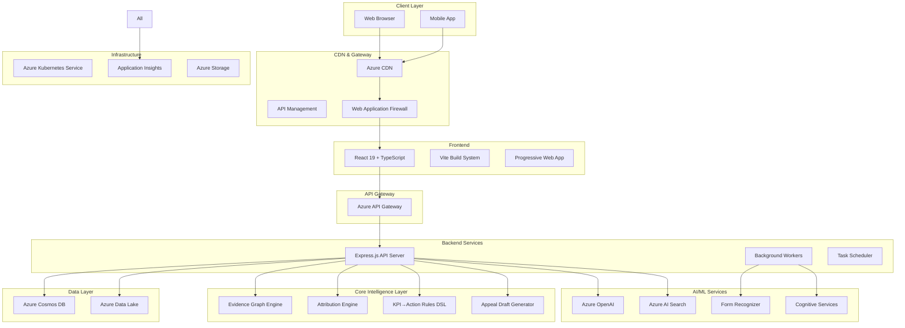

# Billigent Technical Architecture

**Version:** 1.1  
**Date:** August 14, 2025  
**Status:** Active Development  
**Owner:** Engineering Team

## Architecture Overview

Billigent is built as a cloud-native, microservices-based platform leveraging Azure's ecosystem for scalability and compliance. The architecture follows Domain-Driven Design (DDD) principles with clear separation of concerns and HIPAA-compliant healthcare data handling.

**Strategic Architecture Principles:**
- **Evidence Graph Provenance**: Hash-based bundle for each draft ensuring immutable audit trace
- **Explainability Attribution**: L1-normalized weighted spans with checksum for trust & governance
- **Closed-Loop KPI→Action DSL**: Event-driven operational triggers for real-time intervention
- **Azure-Native Hybrid Search**: Vector + keyword (RRF) hybrid for precision & recall

## System Architecture Diagram



## Technology Stack

### Frontend Architecture

#### React 19 + TypeScript

- **Framework**: React 19 with concurrent features
- **Language**: TypeScript 5.9+ for type safety
- **Build Tool**: Vite 5.4+ for fast development and optimized builds
- **Styling**: Tailwind CSS 4.1 for utility-first styling
- **Component Library**: Shadcn/ui for consistent design system

#### State Management

- **Server State**: TanStack Query (React Query) for API data management
- **Client State**: React Context + useReducer for application state
- **Form State**: React Hook Form with Zod validation
- **Cache Strategy**: Intelligent caching with stale-while-revalidate

#### Performance Optimizations

- **Code Splitting**: Route-based and component-based lazy loading
- **Bundle Analysis**: Optimized chunks for vendor, UI, and application code
- **Service Worker**: Offline capabilities and intelligent caching
- **Image Optimization**: WebP format with lazy loading

### Backend Architecture

#### Express.js + TypeScript

- **Runtime**: Node.js 20+ with Express.js framework
- **Language**: TypeScript 5.9+ for type safety and developer experience
- **Architecture**: Modular service-based architecture with dependency injection
- **Validation**: Zod schemas for request/response validation
- **Error Handling**: Centralized error handling with structured logging

#### API Design

- **RESTful**: Standard REST endpoints with consistent response formats
- **GraphQL**: Optional GraphQL endpoint for complex data queries
- **Versioning**: API versioning strategy for backward compatibility
- **Rate Limiting**: Intelligent throttling based on usage patterns
- **Error Handling**: Consistent error response format

### Database Architecture

#### Primary Operational Store: Azure Cosmos DB

```typescript
// Core Entity Relationships
interface User {
  id: string;
  email: string;
  department: string;
  createdAt: Date;
  updatedAt: Date;
}

interface Case {
  id: string;
  patientId: string;
  encounterId: string;
  status: 'PENDING' | 'IN_PROGRESS' | 'COMPLETED';
  priority: number;
  estimatedValue: number;
  createdAt: Date;
  assignedTo: string;
}

interface Diagnosis {
  id: string;
  caseId: string;
  icd10Code: string;
  description: string;
  isPresent: boolean;
  specificity: number;
}
```

#### Data Lake Architecture

```
Azure Data Lake Storage Gen2:
/bronze/                    # Raw data ingestion
  /fhir/                   # FHIR resources from EHR systems
    /patients/             # Patient demographics
    /encounters/           # Clinical encounters
    /observations/         # Clinical observations
  /terminologies/          # Medical coding standards
    /icd10/               # ICD-10 diagnosis codes
    /cpt/                 # CPT procedure codes
    /hcpcs/               # HCPCS supply codes
  /documents/              # Unstructured documents
    /denials/             # Denial letters and EOBs
    /clinical-notes/      # Clinical documentation

/silver/                    # Processed and validated data
  /normalized/             # Standardized and cleaned data
  /enriched/               # AI-enhanced data with embeddings
  /validated/              # Quality-checked data

/gold/                      # Business-ready datasets
  /analytics/              # Aggregated metrics and KPIs
  /reporting/              # Standard reports and dashboards
  /ml-features/            # Feature engineering for ML models
```

### AI/ML Architecture

#### Azure OpenAI Integration

```typescript
interface OpenAIArchitecture {
  // Model configuration
  models: {
    gpt4: "gpt-4-turbo-preview";
    gpt35: "gpt-3.5-turbo";
    embedding: "text-embedding-ada-002";
  };

  // Deployment strategy
  deployment: {
    loadBalancing: RoundRobin;
    fallbackStrategy: GracefulDegradation;
    monitoring: ApplicationInsights;
  };

  // Prompt engineering
  prompts: {
    denialAnalysis: DenialAnalysisPrompt;
    appealGeneration: AppealGenerationPrompt;
    codingValidation: CodingValidationPrompt;
  };
}
```

#### Vector Database: Azure AI Search

```typescript
interface RAGArchitecture {
  // Vector store configuration
  vectorStore: {
    service: AzureAISearch;
    dimensions: 1536; // OpenAI embedding dimensions
    similarityAlgorithm: "cosine";
    indexStrategy: "hierarchical";
  };

  // Knowledge sources
  knowledgeSources: {
    medicalCoding: MedicalCodingDatabase;
    clinicalGuidelines: ClinicalGuidelinesDB;
    regulatoryDocs: RegulatoryDocuments;
    historicalCases: CaseHistoryDB;
  };

  // Retrieval pipeline
  retrievalPipeline: {
    queryExpansion: QueryExpansionService;
    semanticSearch: SemanticSearchEngine;
    contextRanking: ContextRankingAlgorithm;
    relevanceFiltering: RelevanceFilter;
  };
}
```

#### Embedding Strategy

```typescript
interface EmbeddingStrategy {
  // Text preprocessing
  preprocessing: {
    tokenization: MedicalTokenizer;
    normalization: TextNormalization;
    entityRecognition: MedicalNER;
  };

  // Embedding generation
  embedding: {
    model: "text-embedding-ada-002";
    batchSize: 100;
    maxTokens: 8191;
    parallelProcessing: true;
  };

  // Vector storage
  storage: {
    indexing: HierarchicalNavigableSmallWorld;
    compression: ProductQuantization;
    updateStrategy: IncrementalUpdate;
  };
}
```

## Data Architecture

### Data Ingestion Pipeline

```typescript
interface DataIngestionPipeline {
  // Source systems
  sources: {
    ehr: EHRSystemConnector;
    claims: ClaimsProcessor;
    documents: DocumentIngestion;
    external: ExternalDataConnector;
  };

  // Processing stages
  stages: {
    validation: DataValidationService;
    transformation: DataTransformationService;
    enrichment: AIEnrichmentService;
    storage: CosmosDBStorage;
  };

  // Quality control
  quality: {
    validation: SchemaValidation;
    profiling: DataProfiling;
    monitoring: QualityMetrics;
  };
}
```

### Data Modeling Strategy

```typescript
interface DataModelingStrategy {
  // Domain models
  domains: {
    clinical: ClinicalDomainModel;
    financial: FinancialDomainModel;
    operational: OperationalDomainModel;
  };

  // Data patterns
  patterns: {
    eventSourcing: EventSourcingPattern;
    cqrs: CommandQueryResponsibilitySegregation;
    saga: SagaPattern;
  };

  // Storage strategy
  storage: {
    operational: CosmosDB;
    analytical: DataLake;
    archival: BlobStorage;
  };
}
```

## Performance Architecture

### Caching Strategy

```typescript
interface CachingStrategy {
  // Cache layers
  layers: {
    application: InMemoryCache;
    distributed: CosmosDB;
    cdn: AzureCDN;
  };

  // Cache policies
  policies: {
    ttl: TimeToLive;
    invalidation: CacheInvalidation;
    compression: DataCompression;
  };

  // Performance metrics
  metrics: {
    hitRate: CacheHitRate;
    latency: ResponseTime;
    throughput: RequestsPerSecond;
  };
}
```

### Scalability Patterns

```typescript
interface ScalabilityPatterns {
  // Horizontal scaling
  horizontal: {
    loadBalancing: AzureLoadBalancer;
    autoScaling: AutoScalingRules;
    containerization: AKS;
  };

  // Vertical scaling
  vertical: {
    resourceAllocation: ResourceManagement;
    performanceTuning: Optimization;
    capacityPlanning: Forecasting;
  };

  // Data partitioning
  partitioning: {
    strategy: PartitioningStrategy;
    sharding: ShardingConfiguration;
    distribution: DataDistribution;
  };
}
```

## Monitoring & Observability

### Application Monitoring

```typescript
interface MonitoringArchitecture {
  // Metrics collection
  metrics: {
    application: ApplicationMetrics;
    infrastructure: InfrastructureMetrics;
    business: BusinessMetrics;
  };

  // Logging strategy
  logging: {
    structured: StructuredLogging;
    correlation: CorrelationIds;
    sampling: LogSampling;
  };

  // Alerting system
  alerting: {
    rules: AlertRules;
    channels: NotificationChannels;
    escalation: EscalationPolicies;
  };
}
```

### Performance Monitoring

```typescript
interface PerformanceMonitoring {
  // Key metrics
  metrics: {
    responseTime: ResponseTimeMetrics;
    throughput: ThroughputMetrics;
    errorRate: ErrorRateMetrics;
    availability: AvailabilityMetrics;
  };

  // Tracing
  tracing: {
    distributed: DistributedTracing;
    correlation: CorrelationIds;
    sampling: TraceSampling;
  };

  // Profiling
  profiling: {
    cpu: CPUProfiling;
    memory: MemoryProfiling;
    network: NetworkProfiling;
  };
}
```

## Deployment Architecture

### Infrastructure as Code

```typescript
interface InfrastructureAsCode {
  // Terraform configuration
  terraform: {
    modules: InfrastructureModules;
    variables: ConfigurationVariables;
    outputs: DeploymentOutputs;
  };

  // Container orchestration
  kubernetes: {
    deployments: ApplicationDeployments;
    services: ServiceDefinitions;
    ingress: IngressConfiguration;
  };

  // CI/CD pipeline
  cicd: {
    build: BuildPipeline;
    test: TestingPipeline;
    deploy: DeploymentPipeline;
  };
}
```

### Environment Management

```typescript
interface EnvironmentManagement {
  // Environment types
  environments: {
    development: DevelopmentEnvironment;
    staging: StagingEnvironment;
    production: ProductionEnvironment;
  };

  // Configuration management
  configuration: {
    secrets: KeyVault;
    settings: AppConfiguration;
    featureFlags: FeatureManagement;
  };

  // Deployment strategies
  deployment: {
    blueGreen: BlueGreenDeployment;
    canary: CanaryDeployment;
    rolling: RollingUpdate;
  };
}
```

## Compliance & Governance

### HIPAA Compliance

```typescript
interface HIPAACompliance {
  // Data protection
  dataProtection: {
    encryption: DataEncryption;
    accessControl: AccessControl;
    auditLogging: AuditLogging;
  };

  // Privacy controls
  privacyControls: {
    dataMinimization: DataMinimization;
    consentManagement: ConsentManagement;
    dataRetention: DataRetention;
  };

  // Security measures
  securityMeasures: {
    networkSecurity: NetworkSecurity;
    endpointSecurity: EndpointSecurity;
    incidentResponse: IncidentResponse;
  };
}
```

### Data Governance

```typescript
interface DataGovernance {
  // Data classification
  classification: {
    sensitivity: SensitivityLevels;
    retention: RetentionPolicies;
    access: AccessPolicies;
  };

  // Data lineage
  lineage: {
    tracking: DataLineageTracking;
    documentation: DataDocumentation;
    impact: ImpactAnalysis;
  };

  // Quality management
  quality: {
    standards: QualityStandards;
    monitoring: QualityMonitoring;
    improvement: QualityImprovement;
  };
}
